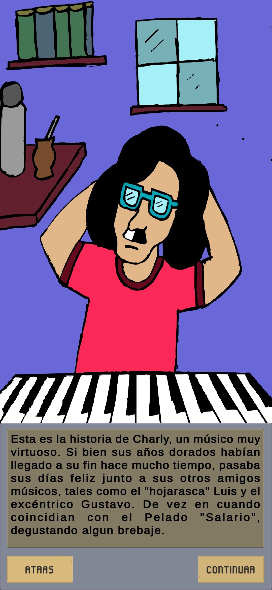

# rezo_juego
<h1 align="center"> Proyecto “Rezo: Un juego de Rock y Rol”  </h1>
<h3 align="center"> Creador: Facundo Urteaga  </h3>
<h3 align="center"> Disponible en: /Ejecutable/rezo.apk (mas info en apartado compatibilidad)  </h3>

   
   

## Índice

*[Descripción del juego](#descripción-del-juego)

*[Proceso de creación](#proceso-de-creación)

*[Background del creador](#background-del-creador)

*[Ejecutable y compatibilidad](#ejecutable-y-compatibilidad)

*[Galería de imágenes](#galeria-de-imágenes)

## Descripción del juego

El juego fue producto de un sueño que tuve desde muy joven, alimentado por mi pasión por los videojuegos y el rock nacional, así como por el deseo de crear un juego con esta impronta desde cero. Su desarrollo tuvo lugar principalmente durante la pandemia, un tiempo en el que sentía mucha incertidumbre sobre mi futuro. Durante mucho tiempo, quedó a medio camino (y sigue en desarrollo), ya que resultó que me había embarcado en un proyecto muy grande y ambicioso en cuanto a la complejidad del juego, considerando que una sola persona (yo) iba a estar a cargo de todas las aristas del proyecto. Sin embargo, en este último tiempo decidí darle una forma presentable y terminada, al menos del primer nivel, teniendo en el horizonte el deseo de, en algún momento, poder trabajar en este tipo de proyectos.

   

   <em> </em>

En cuanto a la historia, el juego está inspirado en Charly, un joven músico que se encuentra con una entidad maligna que atrapa a sus amigos músicos y amenaza con dejarlos en el olvido. La misión de Charly es rescatar a cada uno de ellos con la ayuda de una legendaria aliada llamada Mercedes, quien lo salva del mismo destino que sus amigos y lo asistirá en el resto de la aventura. Cada escenario se centra en el rescate de uno de sus amigos. En este primer escenario de prueba, Charly debe rescatar a su amigo Luis. 
El juego es del género RPG, lo que significa que cuenta con exploración, historia, desarrollo de habilidades del personaje y administración de inventario. En cuanto al combate, es similar a los juegos RPG basados en turnos, como Pokémon o Final Fantasy.

## Proceso de creación

El desarrollo contó con múltiples obstáculos y desafíos. Por un lado, la parte artística se resolvió en parte mediante el escaneo de dibujos hechos por mí mismo, que luego fueron digitalizados y vectorizados con herramientas como Adobe Illustrator. Por otro lado, se utilizaron sprites gratuitos descargados de diferentes páginas y editados con distintas herramientas digitales. La programación y el aprendizaje del uso de las herramientas de Unity también fueron un gran desafío que pude sortear gracias a mis conocimientos previos de distintos lenguajes de programación, a videos tutoriales de YouTube y a los cursos virtuales que realicé sobre Unity (ver apartado “Background del creador”). La música fue descargada de páginas de sonidos sin copyright, y la narrativa y demás detalles fueron producto de mi imaginación e inspiración, acumuladas a lo largo de toda una vida dedicada a la música y los videojuegos.

## Background del creador

•	Conocimientos previos de lenguajes de programación: C, C++, Python
•	Conocimientos previos de arte, dibujo y herramientas de edición de imágenes
•	Cursos de desarrollo de videojuegos 2D con Unity de la página Domestika
•	Videotutoriales de youtube

## Ejecutable y compatibilidad

El juego está pensado para un dispositivo móvil. Fue testeado en Samsung Galaxy S10e y Samsung Galaxy S23. Dentro de la carpeta “Ejecutable” se encuentra el instalador .apk listo para ejecutar.
 

## Galería de imágenes

   

   

   

   

   

   

   

   

   

   

   

   

   

   

   

   

